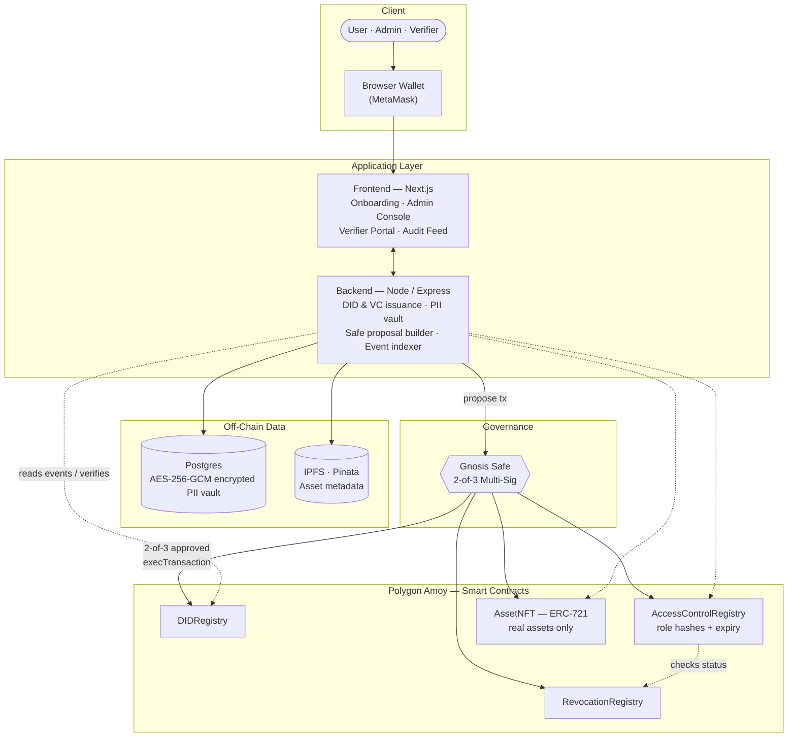
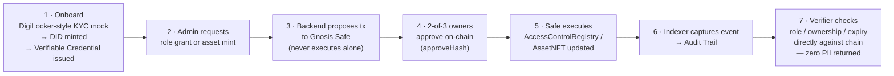

# TrustMesh

**Team Aegis · SIH PS 26125 · Blockchain-Based Secure Platform for Identity, Access Control & Digital Asset Management**

> The chain stores proofs — never people.

TrustMesh is a privacy-preserving, DPDP-compliant identity and digital-asset platform. Identity is a self-sovereign **W3C DID + Verifiable Credential** — never a raw NFT or a bare wallet address. Access is enforced as **on-chain, expiring, revocable role hashes** (literal RBAC, per the problem statement — not a substitute ABAC scheme). Every privileged action — role grant, role revoke, asset mint, asset transfer — is proposed to a **Gnosis Safe multi-sig** and only executes once independent signers approve it on-chain; no single admin key can ever act alone. Personally identifiable information never touches the chain: it lives off-chain in an encrypted vault, and DPDP's Right to Erasure is honored by destroying the encryption key (crypto-shredding), not by rewriting history.

## Why this exists

Government and enterprise systems today either centralize identity (single point of compromise, single point of failure) or bolt access control onto infrastructure that has no notion of expiry, revocation, or accountable multi-party approval. TrustMesh answers PS 26125 directly: a reusable identity layer, role-based access control with a real lifecycle, and NFT-backed custody for real assets — all governed so that no one actor, technical or human, can unilaterally mint, grant, or revoke.

## Architecture



## End-to-end workflow



## Project Layout

```
contracts/   Hardhat project — DIDRegistry, RevocationRegistry, AccessControlRegistry, AssetNFT
backend/     Node/Express API — DID/VC issuance, encrypted PII vault, IPFS, Safe proposals, event indexer
frontend/    Next.js app — onboarding, admin console, verifier portal, audit feed
```

## Quickstart

```bash
# Contracts
cd contracts && npm install && npm run deploy:amoy
BACKEND_RELAYER_ADDRESS=0x... npm run configure:amoy

# Backend
cd ../backend && npm install && npm run migrate && npm run dev   # :4000

# Frontend
cd ../frontend && npm install && npm run dev                     # :3000
```

Contracts compile clean on Solidity 0.8.24 / Cancun EVM (`npm test` in `contracts/`). Both `backend` and `frontend` type-check clean and `frontend` builds clean.

A local, faucet-free demo path (Hardhat node + a genuinely deployed local Gnosis Safe, real 2-of-3 on-chain approvals) is also fully wired for offline judge walkthroughs — no testnet funds required.

## What's on-chain vs. off-chain, and why

| Data | Location | Reason |
|---|---|---|
| Identity (DID document) | On-chain | Publicly resolvable, tamper-evident, no central registry to compromise |
| Role grants (hashed, with expiry) | On-chain | Auditable, expiring, revocable — never a permanent unlabeled grant |
| Real-world PII | Off-chain, encrypted (Postgres) | DPDP compliance — Right to Erasure via key destruction, impossible on an immutable ledger |
| Asset metadata | IPFS, hash-pinned on-chain | Content-addressed integrity without bloating chain storage |
| Admin approvals | Gnosis Safe (on-chain) | No single key — compromise of one signer cannot mint, grant, or revoke anything |

## Explicit Non-Goals (Prototype Scope)

Stated honestly rather than hidden:

- No real ZK selective-disclosure proofs
- No production DigiLocker/Aadhaar integration — sandboxed mock KYC only
- No permissioned Hyperledger Fabric migration — Polygon Amoy testnet only
- Multi-sig mitigates single-key compromise, not signer collusion
