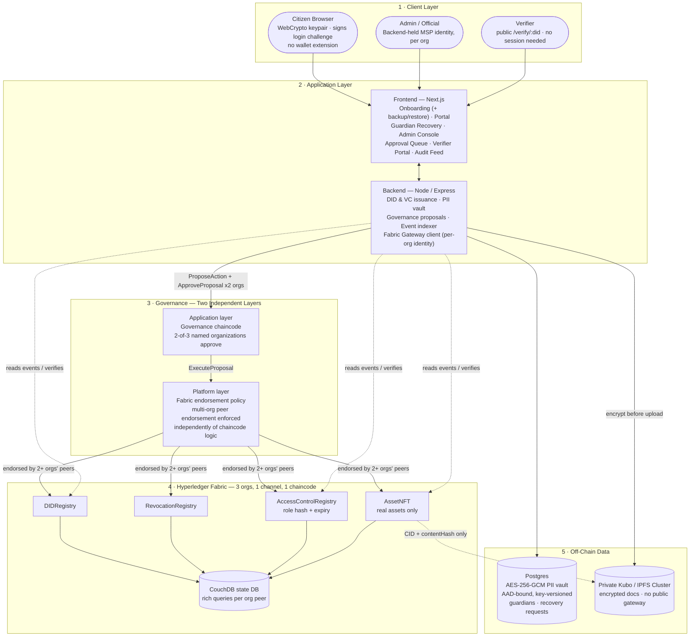
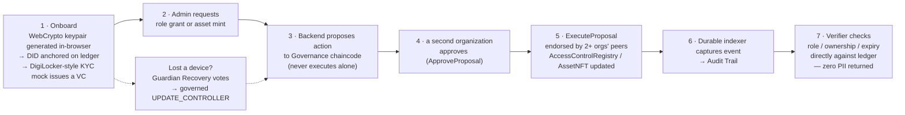

# TrustMesh

**Team Meow · SIH PS 26125 · Blockchain-Based Secure Platform for Identity, Access Control & Digital Asset Management**

> The chain stores proofs — never people.

TrustMesh is a privacy-preserving, DPDP-compliant identity and digital-asset platform, currently running on a permissioned **Hyperledger Fabric** network (3 organizations, one channel, one chaincode of five contracts). Identity is a self-sovereign **W3C-style DID + Verifiable Credential**, held as an ordinary WebCrypto keypair in the citizen's browser — never a raw NFT, never a wallet extension, never issued or revocable by an admin. Access is enforced as **ledger-recorded, expiring, revocable role hashes** (literal RBAC, per the problem statement — not a substitute ABAC scheme). Every privileged action — role grant, role revoke, asset mint, asset transfer, DID controller update — is **proposed to a Governance chaincode and only executes once a second organization approves it**, and is independently re-endorsed at the platform layer by Fabric's own multi-organization endorsement policy; no single admin key, and no single compromised organization, can act alone. Personally identifiable information never touches the ledger: it lives off-chain in an encrypted Postgres vault, and DPDP's Right to Erasure is honored by destroying the encryption key (crypto-shredding), not by rewriting history.

> An earlier, fully working **EVM/Solidity/Gnosis-Safe** stack is preserved in parallel (`contracts/`, `backend/src/server.ts`, the EVM routes/services) rather than deleted — see [Fabric Migration](#fabric-migration-evm-prototype--hyperledger-fabric) below for why the project moved, and how to still run the original stack.

## Why this exists

Government and enterprise systems today either centralize identity (single point of compromise, single point of failure) or bolt access control onto infrastructure that has no notion of expiry, revocation, or accountable multi-party approval. TrustMesh answers PS 26125 directly: a reusable identity layer, role-based access control with a real lifecycle, and chaincode-custodied digital assets (the `AssetNFT` contract, named for continuity with the original ERC-721 design it replaces) — all governed so that no one actor, technical or human, can unilaterally mint, grant, or revoke.

## Architecture



**Current stack**: a permissioned 3-organization **Hyperledger Fabric** network — Org1 (IssuingDept), Org2 (AuditOrg), Org3 (IndependentVerifier) — with a genuinely running orderer, 3 peers, 3 CouchDB state databases, and deployed chaincode. Bring it up with `./fabric/network-up.sh && ./fabric/deploy-chaincode.sh`, verify with `./fabric/verify-network.sh && ./fabric/verify-chaincode.sh`. **Fallback stack**: the original EVM/Solidity/Gnosis-Safe prototype, preserved and still runnable — see [Fabric Migration](#fabric-migration-evm-prototype--hyperledger-fabric) below for exactly what changed and why.

## End-to-end workflow



## Security Architecture

**Governance — two independent layers, not one.** TrustMesh replaced the EVM stack's Gnosis Safe with an application-level Governance chaincode: a privileged action is *proposed* by one named signer and does not take effect until a threshold of **other named signers, from different organizations** (2-of-3 today — Org1/IssuingDept, Org2/AuditOrg, Org3/IndependentVerifier), have each consciously submitted their own approval. That answers "did a specific person consciously authorize this?" — the same property the Safe design had. Underneath it, independently, Fabric's own **endorsement policy** requires that multiple organizations' peers separately endorse the write itself, at the platform layer — answering "could one compromised organization's infrastructure forge this state, including the approval bookkeeping above?" Layer one without layer two could be corrupted by a single compromised peer; layer two without layer one is infrastructure auto-validating with no human ever approving. Together they're a strict improvement over the Safe's single layer, not a downgrade — see `chaincode/trustmesh/src/governance.contract.ts` for the full reasoning.

**Identity — self-sovereign, recoverable, never a wallet-as-identity.** A user's DID is an ordinary WebCrypto P-256 keypair generated in-browser and stored as a non-extractable key — a compromised page can ask the browser to *sign* with it, but can never exfiltrate it. It's controlled solely by the citizen's own key, never issued or revocable by an admin. Two recovery paths exist for a lost device: an **encrypted backup** (passphrase-wrapped, AES-256-GCM, created at onboarding) that restores the exact same identity on a new device; and **guardian-based social recovery** (`/recovery` page) for when no backup was made — guardians vote to propose a new controller key, and re-binding the DID is itself a governed, multi-organization-approved chaincode action, never a single backend key's unilateral decision. Adding a guardian requires the *current* controller's own session, so nobody can install themselves as someone else's guardian.

**Encryption vs. hashing — deliberately different, deliberately separate.** Hashing (used on-chain) is one-way and irreversible — it only proves content hasn't changed. Encryption (used off-chain, AES-256-GCM, unique key per field) is *meant* to be reversible, but only by whoever holds the key. Security comes from protecting that key, not from making the process irreversible.

**Key custody.** The production design moves every server-side key — the PII vault master key, the per-organization Fabric MSP identities, the VC-issuer key — out of plaintext configuration and into a dedicated key-management service (OpenBao's Transit engine, optionally backed by a hardware security module), so a compromised server never yields a usable key directly.

**Document storage.** Files behind an asset are encrypted before upload. Production storage is a private, self-hosted IPFS/Kubo cluster on institution-controlled infrastructure — not a public IPFS gateway — so encrypted content never leaves controlled infrastructure even though the content-addressing model stays identical.

**External verification, not self-certification.** Before any real-network deployment: an independent smart-contract audit, and a CERT-In empanelled security audit — a government-approved, independent auditor, not the team that built it, checking for weaknesses. 14 passing unit tests is coverage, not an audit, and this project does not conflate the two.

## Fabric Migration: EVM Prototype → Hyperledger Fabric

The project's original Solidity/Gnosis-Safe/wagmi stack validated the design fast inside a hackathon build window. It has since **migrated to a permissioned Hyperledger Fabric network** as the current stack — no gas fees, MSP-based identity matching real institutional PKI, and channel-based data privacy between departments that a public chain can't offer. The EVM stack is preserved in full (`contracts/`, `backend/src/server.ts` and its routes/services, `frontend`'s wagmi-era code where still referenced) rather than deleted, so it can still be run and compared directly.

Two problems had no direct EVM-to-Fabric equivalent; both are resolved and running, not open questions:

- **Multi-sig governance** — Fabric has no Gnosis-Safe-style contract. `chaincode/trustmesh/src/governance.contract.ts` layers an application-level propose/approve/execute chaincode (preserving the EVM stack's human, individually-attributable approval flow — see `frontend/app/admin/governance/page.tsx`, the new approval queue that didn't exist under Safe) *underneath* a multi-organization Fabric endorsement policy (a platform-enforced guarantee Solidity never had) — a net security improvement, not a downgrade.
- **Wallet-based identity/login** — Fabric identity is an X.509 certificate meant for organizations, not citizens at scale. Fabric MSP identities stay backend-only (one per organization, in `backend/src/fabric/`), while citizens hold an ordinary WebCrypto keypair generated in-browser (`frontend/lib/identity.ts`), verified via the same signed-challenge login pattern against a ledger-stored public key — self-sovereign identity is fully preserved, and no wallet extension is required.

This did not change the vault design, the DPDP-erasure mechanism, or the RBAC concept, all of which were already chain-agnostic. `fabric/` holds the network bring-up/teardown/verification scripts; `chaincode/trustmesh/` holds the five contracts; `backend/src/fabric/` and `backend/src/routes/fabric/` hold the Fabric-facing backend, run with `npm run dev:fabric` against `backend/.env.fabric.example`.

## Project Layout

```
fabric/               Network bring-up/teardown/verification scripts (3-org test network)
chaincode/trustmesh/   Fabric chaincode — DIDRegistry, RevocationRegistry, AccessControlRegistry, AssetNFT, Governance
backend/               Node/Express API
  src/fabric/            Fabric Gateway client, per-org identity, DID/governance/recovery services (current stack)
  src/routes/fabric/     Fabric-facing routes (npm run dev:fabric, src/server.fabric.ts)
  src/services/          EVM-facing services (fallback stack)
  src/routes/*.routes.ts EVM-facing routes (npm run dev, src/server.ts)
contracts/             Hardhat project — the preserved EVM fallback stack's Solidity contracts
frontend/              Next.js app — onboarding (+ backup/restore), portal, guardian recovery,
                        admin console, approval queue, verifier portal, audit feed
```

## Quickstart (current stack — Hyperledger Fabric)

```bash
# Fabric network (requires Docker + the fabric-samples test-network; see fabric/README.md)
./fabric/network-up.sh && ./fabric/deploy-chaincode.sh
./fabric/verify-network.sh && ./fabric/verify-chaincode.sh   # confirm before relying on it

# Backend
cd backend && npm install && cp .env.fabric.example .env   # then fill in the generated secrets
npm run migrate && npm run dev:fabric                        # :4000

# Frontend
cd ../frontend && npm install && cp .env.local.example .env.local
npm run dev                                                   # :3000
```

Both `backend` and `frontend` type-check clean and `frontend` builds clean. Chaincode unit/integration checks run via `./fabric/verify-chaincode.sh` against the live network rather than a mocked ledger.

### Quickstart (fallback stack — EVM/Solidity)

```bash
# Contracts
cd contracts && npm install && cp .env.example .env   # then fill in a testnet key
npm run deploy:amoy
BACKEND_RELAYER_ADDRESS=0x... npm run configure:amoy

# Backend
cd ../backend && npm install && cp .env.example .env
npm run migrate && npm run dev   # :4000

# Frontend
cd ../frontend && npm install && npm run dev   # :3000
```

Contracts compile clean on Solidity 0.8.24 / Cancun EVM (`npm test` in `contracts/`). A local, faucet-free demo path (Hardhat node + a genuinely deployed local Gnosis Safe, real 2-of-3 on-chain approvals) is also fully wired for offline walkthroughs — no testnet funds required.

## What's on-ledger vs. off-ledger, and why

| Data | Location | Reason |
|---|---|---|
| Identity (DID record) | On-ledger | Publicly resolvable, tamper-evident, no central registry to compromise |
| Role grants (hashed, with expiry) | On-ledger | Auditable, expiring, revocable — never a permanent unlabeled grant |
| Real-world PII | Off-ledger, encrypted (Postgres) | DPDP compliance — Right to Erasure via key destruction, impossible on an immutable ledger |
| Asset metadata / documents | Encrypted off-ledger store, hash-pinned on-ledger | Content-addressed integrity without bloating ledger storage or exposing content publicly |
| Guardian list / recovery request state | Off-ledger (Postgres) | Guardian voting is a lightweight, revisable off-chain step; only the resulting `UPDATE_CONTROLLER` re-binding is a governed on-ledger write |
| Admin approvals | Governance chaincode (2-of-3 orgs) + Fabric endorsement policy | No single key, no single organization — compromise of one signer or one org's infrastructure cannot mint, grant, revoke, or re-bind an identity |

## Known Issues & Incomplete Work

Tracked honestly rather than glossed over.

### Current stack (Hyperledger Fabric)

- Guardian recovery requires at least two guardians to ever be votable to completion — with exactly one guardian, `Math.ceil(1/2)+1 = 2` can never be reached by a single vote, so recovery silently deadlocks. This is documented in `backend/src/fabric/recovery.service.ts` and the Recovery page now says so explicitly, but the flow doesn't yet hard-block adding only one guardian.
- No rate limiting, request throttling, or other production API hardening has been added yet.
- No CI pipeline runs the Fabric backend tests (`backend/test/fabric/`), `tsc --noEmit`, or `next build` on push.
- No mobile-responsiveness or accessibility (GIGW) pass has been done on the frontend.
- The chaincode and governance design have not had a formal, independent security audit — passing unit/integration checks (`./fabric/verify-chaincode.sh`) is coverage, not an audit.

### Fallback stack (EVM/Solidity) — unchanged from before the migration

- The real Polygon Amoy deployment path (`deploy.ts` + `configureSafe.ts` against Amoy) has never actually been executed — compiled and unit-tested only, blocked by Amoy faucets failing to dispense test POL. The demo runs on a local Hardhat chain with a real, but locally-deployed, Gnosis Safe.
- `/verify/:did` on this stack derives asset ownership by replaying cached `AssetMinted` / `AssetTransferred` events from an in-memory indexer, not an authoritative on-chain enumeration — `AssetNFT` deliberately doesn't implement `ERC721Enumerable`.
- `AccessControlRegistry`'s admin authority resolves to a single Safe address with no built-in succession path — a 4-tier authority model (operational / custodian / timelock / dormant-root tiers) was the designed fix for a real deployment on this stack, but never landed, and the contract is immutable after deployment.
- `NEXT_PUBLIC_WALLETCONNECT_PROJECT_ID` is a placeholder (`trustmesh-dev`) — fine for MetaMask's injected connector locally, but WalletConnect-based mobile wallets need a real project ID from https://cloud.reown.com.
- Two separate frontend env files exist for two different networks (Amoy vs. local Hardhat) — it's easy to run the app against stale contract addresses if the wrong one is active; there's no runtime warning if they drift.
- No backend or frontend test suite exists for this stack — only the 4 smart contracts have tests.
- The 4 custom contracts and the vendored Safe v1.4.1 contracts have not had a formal security audit.

## Environment Files

None of the real env files are committed (see `.gitignore`) — copy the matching `.env.example` and fill it in locally before running that piece. Every example file's values are placeholders or safe local-dev defaults, never real secrets.

| Example file | Copy to | Used by |
|---|---|---|
| `backend/.env.fabric.example` | `backend/.env` | Fabric backend (`npm run dev:fabric`) — **current stack** |
| `backend/.env.example` | `backend/.env` | EVM fallback backend (`npm run dev`) |
| `contracts/.env.example` | `contracts/.env` | Hardhat deploy/configure scripts, EVM fallback stack only |
| `frontend/.env.local.example` | `frontend/.env.local` | Next.js app — works against either backend |

`backend/.env.example` and `backend/.env.fabric.example` are two genuinely different variable sets for two different stacks (one backend process runs one or the other, never both against the same `.env`), not two copies of the same file — see each file's own header for which is which. The frontend needs only one variable regardless of which backend it points at (`NEXT_PUBLIC_BACKEND_URL`): since the Fabric migration it never holds chain RPC config, contract addresses, or a WalletConnect project ID — it talks only to the backend, never to the ledger/chain directly.

See each `.env.example` file for the full variable list and generation commands (e.g. `openssl rand -hex 32` for the vault/session/VC-issuer keys) — they're kept there rather than duplicated here so there's exactly one place that can drift out of date.

## Explicit Non-Goals (Prototype Scope)

Stated honestly rather than hidden:

- No real ZK selective-disclosure proofs
- No production DigiLocker/Aadhaar integration — sandboxed mock KYC only
- No real Polygon Amoy deployment of the fallback EVM stack — compiled and unit-tested only (see [Known Issues](#known-issues--incomplete-work))
- 2-of-3 organizational governance mitigates single-signer and single-organization compromise, not full cross-organization collusion — raising the number of organizations required to collude is the point of the design, not a claim that collusion is impossible, by definition of any threshold scheme
- No land-record-specific logic anywhere in this codebase — PS 26125 is asset-type-agnostic; land records are used only as an illustrative, real-world example in project literature, never a build requirement
