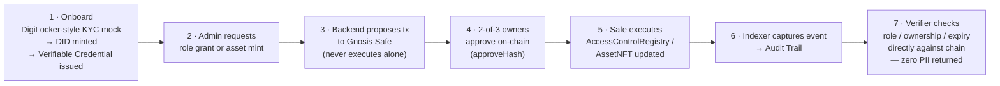

# TrustMesh

**Team Aegis · SIH PS 26125 · Blockchain-Based Secure Platform for Identity, Access Control & Digital Asset Management**

> The chain stores proofs — never people.

TrustMesh is a privacy-preserving, DPDP-compliant identity and digital-asset platform. Identity is a self-sovereign **W3C DID + Verifiable Credential** — never a raw NFT or a bare wallet address. Access is enforced as **on-chain, expiring, revocable role hashes** (literal RBAC, per the problem statement — not a substitute ABAC scheme). Every privileged action — role grant, role revoke, asset mint, asset transfer — is proposed to a **Gnosis Safe multi-sig** and only executes once independent signers approve it on-chain; no single admin key can ever act alone. Personally identifiable information never touches the chain: it lives off-chain in an encrypted vault, and DPDP's Right to Erasure is honored by destroying the encryption key (crypto-shredding), not by rewriting history.

## Why this exists

Government and enterprise systems today either centralize identity (single point of compromise, single point of failure) or bolt access control onto infrastructure that has no notion of expiry, revocation, or accountable multi-party approval. TrustMesh answers PS 26125 directly: a reusable identity layer, role-based access control with a real lifecycle, and NFT-backed custody for real assets — all governed so that no one actor, technical or human, can unilaterally mint, grant, or revoke.

## Architecture


## End-to-end workflow



## Project Layout

```
contracts/   Hardhat project — DIDRegistry, RevocationRegistry, AccessControlRegistry, AssetNFT
backend/     Node/Express API — DID/VC issuance, encrypted PII vault, IPFS, Safe proposals, event indexer
frontend/    Next.js app — onboarding, admin console, verifier portal, audit feed
```

## Quickstart

```bash
# Contracts
cd contracts && npm install && npm run deploy:amoy
BACKEND_RELAYER_ADDRESS=0x... npm run configure:amoy

# Backend
cd ../backend && npm install && npm run migrate && npm run dev   # :4000

# Frontend
cd ../frontend && npm install && npm run dev                     # :3000
```

Contracts compile clean on Solidity 0.8.24 / Cancun EVM (`npm test` in `contracts/`). Both `backend` and `frontend` type-check clean and `frontend` builds clean.

A local, faucet-free demo path (Hardhat node + a genuinely deployed local Gnosis Safe, real 2-of-3 on-chain approvals) is also fully wired for offline judge walkthroughs — no testnet funds required.

## What's on-chain vs. off-chain, and why

| Data | Location | Reason |
|---|---|---|
| Identity (DID document) | On-chain | Publicly resolvable, tamper-evident, no central registry to compromise |
| Role grants (hashed, with expiry) | On-chain | Auditable, expiring, revocable — never a permanent unlabeled grant |
| Real-world PII | Off-chain, encrypted (Postgres) | DPDP compliance — Right to Erasure via key destruction, impossible on an immutable ledger |
| Asset metadata | IPFS, hash-pinned on-chain | Content-addressed integrity without bloating chain storage |
| Admin approvals | Gnosis Safe (on-chain) | No single key — compromise of one signer cannot mint, grant, or revoke anything |

## Known Issues & Incomplete Work

Tracked honestly rather than glossed over.

**Backend**
- `PINATA_JWT` is unset by default — live asset-mint IPFS pinning will error until a Pinata key is configured; the pre-seeded local demo asset ships with placeholder metadata so this doesn't block a click-through demo.
- `/verify/:did` derives asset ownership by replaying cached `AssetMinted` / `AssetTransferred` events from the in-memory indexer, not an authoritative on-chain enumeration — `AssetNFT` deliberately doesn't implement `ERC721Enumerable`. A production version needs a real indexed owner map (subgraph or DB-backed).
- Guardian recovery (`DIDRegistry.setRecoveryModule`) is wired to a single stand-in address in the local demo, not a real M-of-N guardian voting scheme — the contract supports a recovery module, but that module's own governance logic hasn't been built.
- No backend test suite (unit or integration) — only the 4 smart contracts have tests.
- No rate limiting, request throttling, or other production API hardening has been added.

**Frontend / Web3**
- Wallet sign-in (the signed-DID challenge → session → Admin/Portal write flows) has only been smoke-tested via the RainbowKit connect modal UI — it has not been exercised end-to-end with a real MetaMask signature in this environment (no wallet extension available here). Verify it yourself with a real browser before demoing.
- `NEXT_PUBLIC_WALLETCONNECT_PROJECT_ID` is a placeholder (`trustmesh-dev`) — fine for MetaMask's injected connector locally, but WalletConnect-based mobile wallets need a real project ID from https://cloud.reown.com.
- Two separate frontend env files exist for two different networks (Amoy vs. local Hardhat) — see table below. It's easy to run the app against stale contract addresses if the wrong one is active; there's no runtime warning if they drift.
- No frontend test suite (unit or e2e) has been written.
- No mobile-responsiveness pass has been done.

**Smart Contracts / Chain**
- The real Polygon Amoy deployment path (`deploy.ts` + `configureSafe.ts` against Amoy) has never actually been executed — it's compiled and unit-tested only. It was blocked by Amoy faucets (Polygon's own OAuth, Alchemy, Chainlink) all failing to dispense test POL; the demo instead runs on a local Hardhat chain with a real, but locally-deployed, Gnosis Safe.
- `configureSafe.ts` assumes a Gnosis Safe already exists at `GNOSIS_SAFE_ADDRESS` (created via the real Safe{Wallet} UI on Amoy) — that manual step has not been performed.
- The 4 custom contracts (`DIDRegistry`, `RevocationRegistry`, `AccessControlRegistry`, `AssetNFT`) and the vendored Safe v1.4.1 contracts have not had a formal security audit — 14 passing unit tests is coverage, not an audit.
- No CI pipeline runs `hardhat test` / `tsc --noEmit` / `next build` on push.

## Environment Files

None of these are committed (see `.gitignore`) — each must be created locally before running that piece. Values below are placeholders/samples, not real secrets.

| File | Used by |
|---|---|
| `contracts/.env` | Hardhat config + deploy/configure scripts, real Amoy deployment only |
| `backend/.env` | Express API — chain RPC, contract addresses, Safe mode, PII vault key, session secret |
| `frontend/.env` | Next.js app — default/production config, points at Amoy |
| `frontend/.env.local` | Next.js app — local demo override, points at local Hardhat chain (Next.js loads this *over* `.env`) |

**`contracts/.env`**
```bash
AMOY_RPC_URL=https://rpc-amoy.polygon.technology
DEPLOYER_PRIVATE_KEY=0xyour_deployer_private_key_here
GNOSIS_SAFE_ADDRESS=0xyour_already_deployed_safe_address
```
`configureSafe.ts` additionally reads `BACKEND_RELAYER_ADDRESS` — passed inline at invocation (`BACKEND_RELAYER_ADDRESS=0x... npm run configure:amoy`), not stored in the file.

**`backend/.env`**
```bash
PORT=4000
FRONTEND_ORIGIN=http://localhost:3000

DATABASE_URL=postgres://localhost:5432/trustmesh

AMOY_RPC_URL=https://rpc-amoy.polygon.technology
CHAIN_ID=80002
CHAIN_PRIVATE_KEY=0xyour_relayer_private_key_here

DID_REGISTRY_ADDRESS=0x...
REVOCATION_REGISTRY_ADDRESS=0x...
ACCESS_CONTROL_REGISTRY_ADDRESS=0x...
ASSET_NFT_ADDRESS=0x...
GNOSIS_SAFE_ADDRESS=0x...

# Local-demo-only — bypasses the hosted Safe Transaction Service (which can't
# see a local chain) and executes the real 2-of-3 approval on-chain directly.
# Leave false/unset against a real network.
SAFE_LOCAL_MODE=false
LOCAL_SAFE_OWNER1_KEY=
LOCAL_SAFE_OWNER2_KEY=

PINATA_JWT=your_pinata_jwt_here
PII_VAULT_MASTER_KEY=64_char_hex_aes_256_key_here
SESSION_SECRET=any_long_random_string_here
```

**`frontend/.env`**
```bash
NEXT_PUBLIC_CHAIN_ID=80002
NEXT_PUBLIC_AMOY_RPC_URL=https://rpc-amoy.polygon.technology
NEXT_PUBLIC_BACKEND_URL=http://localhost:4000
NEXT_PUBLIC_WALLETCONNECT_PROJECT_ID=your_walletconnect_project_id

NEXT_PUBLIC_DID_REGISTRY_ADDRESS=0x...
NEXT_PUBLIC_REVOCATION_REGISTRY_ADDRESS=0x...
NEXT_PUBLIC_ACCESS_CONTROL_REGISTRY_ADDRESS=0x...
NEXT_PUBLIC_ASSET_NFT_ADDRESS=0x...
```

**`frontend/.env.local`** (local-chain demo override)
```bash
NEXT_PUBLIC_BACKEND_URL=http://localhost:4000

NEXT_PUBLIC_CHAIN_ID=31337
NEXT_PUBLIC_AMOY_RPC_URL=http://127.0.0.1:8545

NEXT_PUBLIC_DID_REGISTRY_ADDRESS=0x...
NEXT_PUBLIC_REVOCATION_REGISTRY_ADDRESS=0x...
NEXT_PUBLIC_ACCESS_CONTROL_REGISTRY_ADDRESS=0x...
NEXT_PUBLIC_ASSET_NFT_ADDRESS=0x...

NEXT_PUBLIC_WALLETCONNECT_PROJECT_ID=trustmesh-dev
```

## Explicit Non-Goals (Prototype Scope)

Stated honestly rather than hidden:

- No real ZK selective-disclosure proofs
- No production DigiLocker/Aadhaar integration — sandboxed mock KYC only
- No permissioned Hyperledger Fabric migration — Polygon Amoy testnet only
- Multi-sig mitigates single-key compromise, not signer collusion
