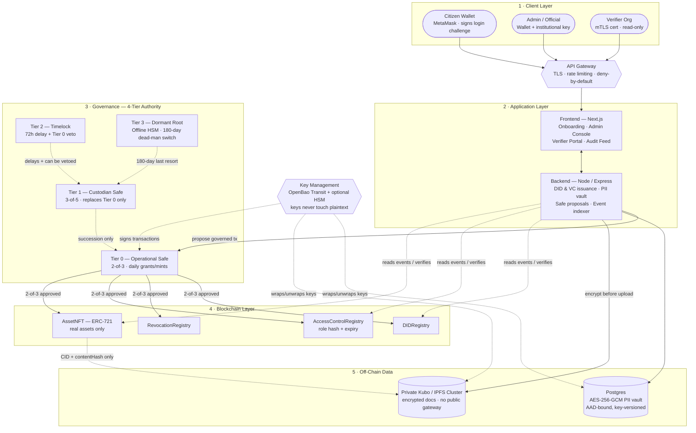
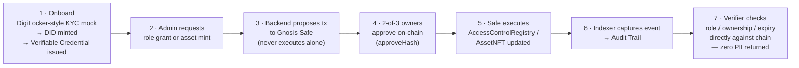

# TrustMesh

**Team Meow · SIH PS 26125 · Blockchain-Based Secure Platform for Identity, Access Control & Digital Asset Management**

> The chain stores proofs — never people.

TrustMesh is a privacy-preserving, DPDP-compliant identity and digital-asset platform. Identity is a self-sovereign **W3C DID + Verifiable Credential** — never a raw NFT or a bare wallet address. Access is enforced as **on-chain, expiring, revocable role hashes** (literal RBAC, per the problem statement — not a substitute ABAC scheme). Every privileged action — role grant, role revoke, asset mint, asset transfer — is proposed to a **Gnosis Safe multi-sig** and only executes once independent signers approve it on-chain; no single admin key can ever act alone. Personally identifiable information never touches the chain: it lives off-chain in an encrypted vault, and DPDP's Right to Erasure is honored by destroying the encryption key (crypto-shredding), not by rewriting history.

## Why this exists

Government and enterprise systems today either centralize identity (single point of compromise, single point of failure) or bolt access control onto infrastructure that has no notion of expiry, revocation, or accountable multi-party approval. TrustMesh answers PS 26125 directly: a reusable identity layer, role-based access control with a real lifecycle, and NFT-backed custody for real assets — all governed so that no one actor, technical or human, can unilaterally mint, grant, or revoke.

## Architecture



**Prototype today** runs the Blockchain Layer on a public EVM-compatible testnet (Solidity + Hardhat + a genuinely deployed Gnosis Safe). **Production target** is a permissioned **Hyperledger Fabric** network — see [Production Migration](#production-migration-evm-prototype--hyperledger-fabric) below for exactly what changes and why.

## End-to-end workflow



## Security Architecture

**Governance — no single point of permanent failure.** A flat 2-of-3 multi-sig has a fatal gap: if all signers leave without enrolling successors first, an immutable contract can never grant or revoke a role again. TrustMesh uses a **4-tier authority model** instead: Tier 0 handles daily approvals; Tier 1 (a separate, larger group across different institutions) can *only* replace Tier 0's signers, never touch citizen data directly; Tier 2 is a 72-hour public timelock Tier 0 can veto, turning any takeover attempt into a visible, cancellable event instead of a silent one; Tier 3 is a dormant, offline-held key that activates only after 180 days of total system inactivity — the true last resort.

**Identity — self-sovereign, recoverable, never a wallet-as-identity.** A user's DID is controlled solely by their own key, never issued or revocable by an admin. If a key is lost, guardian-based social recovery restores access — but adding a guardian requires the *current* controller's own signed approval, so nobody can install themselves as someone else's guardian.

**Encryption vs. hashing — deliberately different, deliberately separate.** Hashing (used on-chain) is one-way and irreversible — it only proves content hasn't changed. Encryption (used off-chain, AES-256-GCM, unique key per field) is *meant* to be reversible, but only by whoever holds the key. Security comes from protecting that key, not from making the process irreversible.

**Key custody.** The production design moves every server-side key — the PII vault master key, the chain relayer key, Safe-signer keys — out of plaintext configuration and into a dedicated key-management service (OpenBao's Transit engine, optionally backed by a hardware security module), so a compromised server never yields a usable key directly.

**Document storage.** Files behind an asset are encrypted before upload. Production storage is a private, self-hosted IPFS/Kubo cluster on institution-controlled infrastructure — not a public IPFS gateway — so encrypted content never leaves controlled infrastructure even though the content-addressing model stays identical.

**External verification, not self-certification.** Before any real-network deployment: an independent smart-contract audit, and a CERT-In empanelled security audit — a government-approved, independent auditor, not the team that built it, checking for weaknesses. 14 passing unit tests is coverage, not an audit, and this project does not conflate the two.

## Production Migration: EVM Prototype → Hyperledger Fabric

The prototype's Solidity/Gnosis-Safe/wagmi stack was chosen to validate the design fast inside a hackathon build window. The decided production target is **Hyperledger Fabric** — permissioned, no gas fees, MSP-based identity matching real institutional PKI, and channel-based data privacy between departments that a public chain can't offer. Two problems have no direct EVM-to-Fabric equivalent, and both are already resolved by design (not open questions):

- **Multi-sig governance** — Fabric has no Gnosis-Safe-style contract. The decided design layers an application-level propose/approve/execute chaincode (preserving today's human, individually-attributable approval flow) *underneath* a multi-organization Fabric endorsement policy (a platform-enforced guarantee Solidity never had) — a net security improvement, not a downgrade.
- **Wallet-based identity/login** — Fabric identity is an X.509 certificate meant for organizations, not citizens at scale. The decided design keeps Fabric MSP identities backend-only (one per organization) while citizens keep an ordinary decoupled keypair, verified via the same signed-challenge login pattern against a ledger-stored public key — self-sovereign identity is fully preserved.

This migration is scoped, sequenced, and scheduled — not started in code yet. It does not change the vault design, the DPDP-erasure mechanism, or the RBAC concept, all of which are chain-agnostic.

## Project Layout

```
contracts/   Hardhat project — DIDRegistry, RevocationRegistry, AccessControlRegistry, AssetNFT
backend/     Node/Express API — DID/VC issuance, encrypted PII vault, IPFS, Safe proposals, event indexer
frontend/    Next.js app — onboarding, admin console, verifier portal, audit feed
```

## Quickstart

```bash
# Contracts
cd contracts && npm install && npm run deploy:amoy
BACKEND_RELAYER_ADDRESS=0x... npm run configure:amoy

# Backend
cd ../backend && npm install && npm run migrate && npm run dev   # :4000

# Frontend
cd ../frontend && npm install && npm run dev                     # :3000
```

Contracts compile clean on Solidity 0.8.24 / Cancun EVM (`npm test` in `contracts/`). Both `backend` and `frontend` type-check clean and `frontend` builds clean.

A local, faucet-free demo path (Hardhat node + a genuinely deployed local Gnosis Safe, real 2-of-3 on-chain approvals) is also fully wired for offline judge walkthroughs — no testnet funds required.

## What's on-chain vs. off-chain, and why

| Data | Location | Reason |
|---|---|---|
| Identity (DID document) | On-chain | Publicly resolvable, tamper-evident, no central registry to compromise |
| Role grants (hashed, with expiry) | On-chain | Auditable, expiring, revocable — never a permanent unlabeled grant |
| Real-world PII | Off-chain, encrypted (Postgres) | DPDP compliance — Right to Erasure via key destruction, impossible on an immutable ledger |
| Asset metadata / documents | Encrypted off-chain store, hash-pinned on-chain | Content-addressed integrity without bloating chain storage or exposing content publicly |
| Admin approvals | Gnosis Safe / 4-tier authority (on-chain) | No single key — compromise of one signer cannot mint, grant, or revoke anything, and the authority structure itself survives full signer turnover |

## Known Issues & Incomplete Work

Tracked honestly rather than glossed over.

**Backend**
- An internal security review identified authorization gaps in the identity-recovery and PII-write paths where a caller-supplied identifier was trusted instead of being derived from the authenticated session, and a data-erasure endpoint that executed on a single session rather than a governed multi-party approval. Fixes are scoped and prioritized (P0) — see the project's internal change-management notes.
- `PINATA_JWT` is unset by default in a fresh checkout — live asset-mint IPFS pinning errors until configured; the pre-seeded local demo asset ships with placeholder metadata so this doesn't block a click-through demo.
- `/verify/:did` derives asset ownership by replaying cached `AssetMinted` / `AssetTransferred` events from an in-memory indexer, not an authoritative on-chain enumeration — `AssetNFT` deliberately doesn't implement `ERC721Enumerable`. Production needs a durable, checkpointed indexer instead.
- Guardian recovery's on-chain execution and the backend relayer's credential-issuance key are not currently gated by the same multi-party approval as role grants and asset mints — both are flagged for the key-management/governance hardening pass.
- No backend test suite (unit or integration) — only the 4 smart contracts have tests.
- No rate limiting, request throttling, or other production API hardening has been added yet.

**Frontend / Web3**
- Wallet sign-in (the signed-DID challenge → session → Admin/Portal write flows) has been smoke-tested via the RainbowKit connect modal UI in an environment without a wallet extension — verify end-to-end with a real MetaMask signature before demoing.
- `NEXT_PUBLIC_WALLETCONNECT_PROJECT_ID` is a placeholder (`trustmesh-dev`) — fine for MetaMask's injected connector locally, but WalletConnect-based mobile wallets need a real project ID from https://cloud.reown.com.
- Two separate frontend env files exist for two different networks (Amoy vs. local Hardhat) — see table below. It's easy to run the app against stale contract addresses if the wrong one is active; there's no runtime warning if they drift.
- No frontend test suite (unit or e2e) has been written.
- No mobile-responsiveness or accessibility (GIGW) pass has been done.

**Smart Contracts / Chain**
- The real Polygon Amoy deployment path (`deploy.ts` + `configureSafe.ts` against Amoy) has never actually been executed — compiled and unit-tested only, blocked by Amoy faucets failing to dispense test POL. The demo runs on a local Hardhat chain with a real, but locally-deployed, Gnosis Safe.
- `AccessControlRegistry`'s admin authority currently resolves to a single Safe address with no built-in succession path — the 4-tier authority model described above is the designed fix, and must land in the constructor before any real-network deployment since the contract is immutable afterward.
- The 4 custom contracts and the vendored Safe v1.4.1 contracts have not had a formal security audit — 14 passing unit tests is coverage, not an audit.
- No CI pipeline runs `hardhat test` / `tsc --noEmit` / `next build` on push.

## Environment Files

None of these are committed (see `.gitignore`) — each must be created locally before running that piece. Values below are placeholders/samples, not real secrets.

| File | Used by |
|---|---|
| `contracts/.env` | Hardhat config + deploy/configure scripts, real Amoy deployment only |
| `backend/.env` | Express API — chain RPC, contract addresses, Safe mode, PII vault key, session secret |
| `frontend/.env` | Next.js app — default/production config, points at Amoy |
| `frontend/.env.local` | Next.js app — local demo override, points at local Hardhat chain (Next.js loads this *over* `.env`) |

**`contracts/.env`**
```bash
AMOY_RPC_URL=https://rpc-amoy.polygon.technology
DEPLOYER_PRIVATE_KEY=0xyour_deployer_private_key_here
GNOSIS_SAFE_ADDRESS=0xyour_already_deployed_safe_address
```
`configureSafe.ts` additionally reads `BACKEND_RELAYER_ADDRESS` — passed inline at invocation (`BACKEND_RELAYER_ADDRESS=0x... npm run configure:amoy`), not stored in the file.

**`backend/.env`**
```bash
PORT=4000
FRONTEND_ORIGIN=http://localhost:3000

DATABASE_URL=postgres://localhost:5432/trustmesh

AMOY_RPC_URL=https://rpc-amoy.polygon.technology
CHAIN_ID=80002
CHAIN_PRIVATE_KEY=0xyour_relayer_private_key_here

DID_REGISTRY_ADDRESS=0x...
REVOCATION_REGISTRY_ADDRESS=0x...
ACCESS_CONTROL_REGISTRY_ADDRESS=0x...
ASSET_NFT_ADDRESS=0x...
GNOSIS_SAFE_ADDRESS=0x...

# Local-demo-only — bypasses the hosted Safe Transaction Service (which can't
# see a local chain) and executes the real 2-of-3 approval on-chain directly.
# Leave false/unset against a real network.
SAFE_LOCAL_MODE=false
LOCAL_SAFE_OWNER1_KEY=
LOCAL_SAFE_OWNER2_KEY=

PINATA_JWT=your_pinata_jwt_here
PII_VAULT_MASTER_KEY=64_char_hex_aes_256_key_here
SESSION_SECRET=any_long_random_string_here
```

**`frontend/.env`**
```bash
NEXT_PUBLIC_CHAIN_ID=80002
NEXT_PUBLIC_AMOY_RPC_URL=https://rpc-amoy.polygon.technology
NEXT_PUBLIC_BACKEND_URL=http://localhost:4000
NEXT_PUBLIC_WALLETCONNECT_PROJECT_ID=your_walletconnect_project_id

NEXT_PUBLIC_DID_REGISTRY_ADDRESS=0x...
NEXT_PUBLIC_REVOCATION_REGISTRY_ADDRESS=0x...
NEXT_PUBLIC_ACCESS_CONTROL_REGISTRY_ADDRESS=0x...
NEXT_PUBLIC_ASSET_NFT_ADDRESS=0x...
```

**`frontend/.env.local`** (local-chain demo override)
```bash
NEXT_PUBLIC_BACKEND_URL=http://localhost:4000

NEXT_PUBLIC_CHAIN_ID=31337
NEXT_PUBLIC_AMOY_RPC_URL=http://127.0.0.1:8545

NEXT_PUBLIC_DID_REGISTRY_ADDRESS=0x...
NEXT_PUBLIC_REVOCATION_REGISTRY_ADDRESS=0x...
NEXT_PUBLIC_ACCESS_CONTROL_REGISTRY_ADDRESS=0x...
NEXT_PUBLIC_ASSET_NFT_ADDRESS=0x...

NEXT_PUBLIC_WALLETCONNECT_PROJECT_ID=trustmesh-dev
```

## Explicit Non-Goals (Prototype Scope)

Stated honestly rather than hidden:

- No real ZK selective-disclosure proofs
- No production DigiLocker/Aadhaar integration — sandboxed mock KYC only
- No permissioned Hyperledger Fabric deployment yet — the migration is fully designed (see [Production Migration](#production-migration-evm-prototype--hyperledger-fabric)) but not implemented; the running prototype is EVM-testnet only
- Multi-sig mitigates single-key compromise, not full signer collusion — the 4-tier model raises the collusion bar (separate institutions required) but cannot make it impossible, by definition of any threshold scheme
- No land-record-specific logic anywhere in this codebase — PS 26125 is asset-type-agnostic; land records are used only as an illustrative, real-world example in project literature, never a build requirement
