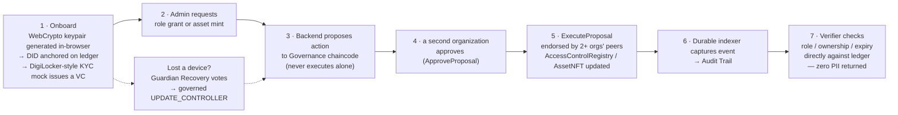

# TrustMesh

**Team Meow · SIH PS 26125 · Blockchain-Based Secure Platform for Identity, Access Control & Digital Asset Management**

> The chain stores proofs — never people.

TrustMesh is a privacy-preserving, DPDP-compliant identity and digital-asset platform, currently running on a permissioned **Hyperledger Fabric** network (3 organizations, one channel, one chaincode of five contracts). Identity is a self-sovereign **W3C-style DID + Verifiable Credential**, held as an ordinary WebCrypto keypair in the citizen's browser — never a raw NFT, never a wallet extension, never issued or revocable by an admin. Access is enforced as **ledger-recorded, expiring, revocable role hashes** (literal RBAC, per the problem statement — not a substitute ABAC scheme). Every privileged action — role grant, role revoke, asset mint, asset transfer, DID controller update — is **proposed to a Governance chaincode and only executes once a second organization approves it**, and is independently re-endorsed at the platform layer by Fabric's own multi-organization endorsement policy; no single admin key, and no single compromised organization, can act alone. Personally identifiable information never touches the ledger: it lives off-chain in an encrypted Postgres vault, and DPDP's Right to Erasure is honored by permanently deleting those off-chain records — ciphertext and wrapped key together — which leaves any on-ledger hash that referenced them pointing at nothing recoverable, rather than by rewriting history.

> The project began on an **EVM/Solidity/Gnosis-Safe** stack. That backend has now been **retired** — see [Fabric Migration](#fabric-migration-evm-prototype--hyperledger-fabric) below for why the project moved and why the old stack was removed rather than kept as a fallback. Its Solidity contracts remain in `contracts/` as an archived reference, no longer wired to the backend.

## Why this exists

Government and enterprise systems today either centralize identity (single point of compromise, single point of failure) or bolt access control onto infrastructure that has no notion of expiry, revocation, or accountable multi-party approval. TrustMesh answers PS 26125 directly: a reusable identity layer, role-based access control with a real lifecycle, and chaincode-custodied digital assets (the `AssetNFT` contract, named for continuity with the original ERC-721 design it replaces) — all governed so that no one actor, technical or human, can unilaterally mint, grant, or revoke.

## Architecture


**Current stack**: a permissioned 3-organization **Hyperledger Fabric** network — Org1 (IssuingDept), Org2 (AuditOrg), Org3 (IndependentVerifier) — with a genuinely running orderer, 3 peers, 3 CouchDB state databases, and deployed chaincode. Bring it up with `./fabric/network-up.sh && ./fabric/deploy-chaincode.sh`, verify with `./fabric/verify-network.sh && ./fabric/verify-chaincode.sh`. This is the only backend stack; see [Fabric Migration](#fabric-migration-evm-prototype--hyperledger-fabric) below for what changed and why.

## End-to-end workflow



## Security Architecture

**Governance — two independent layers, not one.** TrustMesh replaced the EVM stack's Gnosis Safe with an application-level Governance chaincode: a privileged action is *proposed* by one named signer and does not take effect until a threshold of **other named signers, from different organizations** (2-of-3 today — Org1/IssuingDept, Org2/AuditOrg, Org3/IndependentVerifier), have each consciously submitted their own approval. That answers "did a specific person consciously authorize this?" — the same property the Safe design had. Underneath it, independently, Fabric's own **endorsement policy** requires that multiple organizations' peers separately endorse the write itself, at the platform layer — answering "could one compromised organization's infrastructure forge this state, including the approval bookkeeping above?" Layer one without layer two could be corrupted by a single compromised peer; layer two without layer one is infrastructure auto-validating with no human ever approving. Together they're a strict improvement over the Safe's single layer, not a downgrade — see `chaincode/trustmesh/src/governance.contract.ts` for the full reasoning.

**Identity — self-sovereign, recoverable, never a wallet-as-identity.** A user's DID is an ordinary WebCrypto P-256 keypair generated in-browser and stored as a non-extractable key — a compromised page can ask the browser to *sign* with it, but can never exfiltrate it. It's controlled solely by the citizen's own key, never issued or revocable by an admin. Two recovery paths exist for a lost device: an **encrypted backup** (passphrase-wrapped, AES-256-GCM, created at onboarding) that restores the exact same identity on a new device; and **guardian-based social recovery** (`/recovery` page) for when no backup was made — guardians vote to propose a new controller key, and re-binding the DID is itself a governed, multi-organization-approved chaincode action, never a single backend key's unilateral decision. Adding a guardian requires the *current* controller's own session, so nobody can install themselves as someone else's guardian.

**Encryption vs. hashing — deliberately different, deliberately separate.** Hashing (used on-chain) is one-way and irreversible — it only proves content hasn't changed. Encryption (used off-chain, AES-256-GCM, unique key per field) is *meant* to be reversible, but only by whoever holds the key. Security comes from protecting that key, not from making the process irreversible.

**Key custody.** The production design moves every server-side key — the PII vault master key, the per-organization Fabric MSP identities, the VC-issuer key — out of plaintext configuration and into a dedicated key-management service (OpenBao's Transit engine, optionally backed by a hardware security module), so a compromised server never yields a usable key directly.

**Document storage.** Files behind an asset are encrypted before upload. Production storage is a private, self-hosted IPFS/Kubo cluster on institution-controlled infrastructure — not a public IPFS gateway — so encrypted content never leaves controlled infrastructure even though the content-addressing model stays identical.

**External verification, not self-certification.** Before any real-network deployment: an independent smart-contract audit, and a CERT-In empanelled security audit — a government-approved, independent auditor, not the team that built it, checking for weaknesses. 14 passing unit tests is coverage, not an audit, and this project does not conflate the two.

## Fabric Migration: EVM Prototype → Hyperledger Fabric

The project's original Solidity/Gnosis-Safe/wagmi stack validated the design fast inside a hackathon build window. It has since **migrated to a permissioned Hyperledger Fabric network** as the current stack — no gas fees, MSP-based identity matching real institutional PKI, and channel-based data privacy between departments that a public chain can't offer. The EVM **backend** has since been retired rather than kept as a fallback. The reason is specific: citizen identity moved to did:key + WebCrypto P-256, so an authenticated principal became a DID hash rather than an Ethereum address — but the EVM stack was only half-migrated to that. `routes/recovery.routes.ts` still called `buildDid()` on the session principal and `roleGate.middleware.ts` still passed it to an on-chain `hasActiveRole(role, address)`, so every role-gated EVM route threw on a 64-character hash where a 20-byte address was expected. Its on-chain RBAC keyed roles by address and there are no addresses any more, so restoring consistency needed either a contract change or a second identity model maintained in parallel. A fallback whose authorization does not work is worse than no fallback, so it was removed. The Solidity contracts stay in `contracts/` as an archived reference with their 14 unit tests still running in CI.

Two problems had no direct EVM-to-Fabric equivalent; both are resolved and running, not open questions:

- **Multi-sig governance** — Fabric has no Gnosis-Safe-style contract. `chaincode/trustmesh/src/governance.contract.ts` layers an application-level propose/approve/execute chaincode (preserving the EVM stack's human, individually-attributable approval flow — see `frontend/app/admin/governance/page.tsx`, the new approval queue that didn't exist under Safe) *underneath* a multi-organization Fabric endorsement policy (a platform-enforced guarantee Solidity never had) — a net security improvement, not a downgrade.
- **Wallet-based identity/login** — Fabric identity is an X.509 certificate meant for organizations, not citizens at scale. Fabric MSP identities stay backend-only (one per organization, in `backend/src/fabric/`), while citizens hold an ordinary WebCrypto keypair generated in-browser (`frontend/lib/identity.ts`), verified via the same signed-challenge login pattern against a ledger-stored public key — self-sovereign identity is fully preserved, and no wallet extension is required.

This did not change the vault design, the DPDP-erasure mechanism, or the RBAC concept, all of which were already chain-agnostic. `fabric/` holds the network bring-up/teardown/verification scripts; `chaincode/trustmesh/` holds the five contracts; `backend/src/fabric/` and `backend/src/routes/fabric/` hold the backend, run with `npm run dev` against `backend/.env.example`.

## Project Layout

```
fabric/               Network bring-up/teardown/verification scripts (3-org test network)
chaincode/trustmesh/   Fabric chaincode — DIDRegistry, RevocationRegistry, AccessControlRegistry, AssetNFT, Governance
docker-compose.yml     Postgres + Kubo (and, behind a profile, the backend)
backend/               Node/Express API
  Dockerfile             Multi-stage build; runtime image carries no devDependencies
  src/fabric/            Fabric Gateway client, per-org identity, DID/governance/recovery services
  src/routes/fabric/     HTTP routes (npm run dev, src/server.ts)
  src/services/          Chain-agnostic services — PII vault, DPDP erasure, Kubo/IPFS, mock KYC
  migrations/            Versioned SQL migrations (node-pg-migrate). The schema is
                        changed here and nowhere else.
contracts/             ARCHIVED Hardhat project — the retired EVM stack's Solidity. Not wired
                        to the backend; kept for reference, unit tests still run in CI.
frontend/              Next.js app — onboarding (+ backup/restore), portal, guardian recovery,
                        admin console, approval queue, verifier portal, audit feed
```

## Quickstart (current stack — Hyperledger Fabric)

```bash
# Supporting services — Postgres + a private Kubo node
docker compose up -d

# Fabric network (requires Docker + the fabric-samples test-network; see fabric/README.md)
./fabric/network-up.sh && ./fabric/deploy-chaincode.sh
./fabric/verify-network.sh && ./fabric/verify-chaincode.sh   # confirm before relying on it

# Backend
cd backend && npm install && cp .env.example .env   # then fill in the generated secrets
npm run migrate && npm run dev                       # :4000

# Frontend
cd ../frontend && npm install && cp .env.local.example .env.local
npm run dev                                                   # :3000
```

`docker compose up -d` starts only Postgres and Kubo — everything the backend and
the test suite need that is not the ledger. The backend can also run in a
container (`docker compose --profile app up -d`), but that is opt-in because it
additionally needs the fabric-samples checkout mounted and the Fabric Docker
network joined; see the comments in `docker-compose.yml`.

Both `backend` and `frontend` type-check clean and `frontend` builds clean. Chaincode unit/integration checks run via `./fabric/verify-chaincode.sh` against the live network rather than a mocked ledger.

### Running the tests

```bash
docker compose up -d          # Postgres + Kubo
cd backend && npm run migrate && npm test
```

`npm test` covers the P0.1/P0.2/P0.3 authorization guarantees and the Kubo
integration, and needs no ledger — the same set CI runs on every push.
`npm run test:fabric` runs the governed-flow suite, which does need a live 3-org
network.

### Archived contracts

`contracts/` holds the retired EVM stack's Solidity. Nothing in the backend imports it, and there is no EVM backend left to run it against, but it still compiles clean on Solidity 0.8.24 / Cancun and its 14 unit tests still run in CI:

```bash
cd contracts && npm ci && npm test
```

It is kept as a reference for the governance and RBAC designs the chaincode inherited, not as a runnable stack.

## What's on-ledger vs. off-ledger, and why

| Data | Location | Reason |
|---|---|---|
| Identity (DID record) | On-ledger | Publicly resolvable, tamper-evident, no central registry to compromise |
| Role grants (hashed, with expiry) | On-ledger | Auditable, expiring, revocable — never a permanent unlabeled grant |
| Real-world PII | Off-ledger, encrypted (Postgres) | DPDP compliance — Right to Erasure by deleting the record outright, impossible on an immutable ledger |
| Asset metadata / documents | Encrypted off-ledger store, hash-pinned on-ledger | Content-addressed integrity without bloating ledger storage or exposing content publicly |
| Guardian list / recovery request state | Off-ledger (Postgres) | Guardian voting is a lightweight, revisable off-chain step; only the resulting `UPDATE_CONTROLLER` re-binding is a governed on-ledger write |
| Admin approvals | Governance chaincode (2-of-3 orgs) + Fabric endorsement policy | No single key, no single organization — compromise of one signer or one org's infrastructure cannot mint, grant, revoke, or re-bind an identity |

## Known Issues & Incomplete Work

Tracked honestly rather than glossed over.

### Current stack (Hyperledger Fabric)

- **The three organizations all run on one machine.** `fabric/network-up.sh` brings up the official `fabric-samples` test-network extended with `addOrg3`: three peers, three CouchDB instances and four CAs, every one of them a Docker container on `localhost`, with crypto generated by the test network's own CAs. The endorsement policy is genuinely enforced and the three MSPs are genuinely separate, so the 2-of-3 governance mechanism itself is real — but a single operator holds all three organizations' credentials, so compromising that one host compromises all three at once. This is the **single largest gap between this demo and a deployment**, and it is the same limitation the retired EVM stack had, where the "2-of-3" Gnosis Safe ran on Hardhat's publicly-known test keys. Moving from one machine holding three keys to one machine running three peers is a better architecture, not yet a better guarantee: earning that needs three organizations operating their own peers on their own infrastructure with CA-issued MSP material. See `fabric/README.md`.
- **Ledger state does not survive a restart.** `fabric/network-up.sh` begins by tearing the network down, and test-network's teardown removes the CouchDB volumes with it — so a plain re-run destroys every registered DID, granted role and minted asset. `./fabric/network-up.sh --preserve` verifies a running network without touching it, and refuses to continue rather than silently rebuilding an empty ledger. Nothing on the ledger is durable across a full rebuild today.
- Guardian recovery now hard-blocks proposing with fewer than two guardians (`MIN_GUARDIANS`) instead of relying on unreachable threshold arithmetic, and the threshold is a strict majority (`floor(n/2)+1`, i.e. 2-of-3). The previous `ceil(n/2)+1` required unanimity at three guardians, so one unreachable guardian deadlocked recovery permanently. The frontend does not yet steer users toward three guardians, which is what actually buys fault tolerance.
- API hardening is partial: `helmet`, `x-powered-by` removal, per-route rate limiting, hashed session tokens, nonce expiry and a sanitized error handler are all live in `src/server.ts`. Still missing: request schema validation, mTLS on `/verify/:did`, and a tamper-evident API audit log.
- `.github/workflows/ci.yml` runs on every push/PR to `main`: the 14 archived Hardhat contract tests, `frontend` `tsc --noEmit` + `next build`, and for the backend `tsc --noEmit`, the schema migrations, `test/p0-authz.test.ts` (the P0.1/P0.2/P0.3 authorization guarantees), `test/p3.1-ipfs-kubo.test.ts` against a real Kubo service container, and the async-error regression test. The governed-flow tests under `backend/test/fabric/` do NOT run in CI: they need a live 3-org Hyperledger Fabric network (Docker-in-Docker peers/orderer/CAs + generated MSP material via fabric-samples), which is too heavy and flaky for a shared GitHub-hosted runner. They're exercised locally against the live network instead.
- Asset-level DPDP erasure is incomplete. Content is now anchored as a salted commitment (CRY-3) and `forgetContentCommitment()` destroys the salt, which makes the ledger anchor permanently unverifiable — but it is not yet wired into `/vault/erase`, because the mapping from a citizen to the CIDs of their assets lives on the ledger rather than in Postgres. Vault-field erasure is complete; asset erasure needs that mapping first.
- Assets minted before the salted-commitment change carry a bare, unsalted hash. `verifyContentCommitment()` reports those as `unverifiable` rather than guessing.
- The remaining `npm audit` findings in `backend` are all in the vitest/vite/esbuild dev toolchain — dev dependencies, not shipped runtime code. The critical one requires the Vitest UI server to be running, which nothing here does.
- No mobile-responsiveness or accessibility (GIGW) pass has been done on the frontend.
- The chaincode and governance design have not had a formal, independent security audit — passing unit/integration checks (`./fabric/verify-chaincode.sh`) is coverage, not an audit.

### Archived contracts (`contracts/`)

These applied to the retired EVM stack. They are recorded because the archived Solidity still carries them, not because anything runs on it.

- The real Polygon Amoy deployment path was never executed — compiled and unit-tested only, blocked by Amoy faucets failing to dispense test POL.
- `AccessControlRegistry`'s admin authority resolves to a single Safe address with no built-in succession path, and the contract is immutable after deployment. A 4-tier authority model (operational / custodian / timelock / dormant-root) was the designed fix and never landed. **The equivalent question applies to the Fabric governance chaincode and is still open there.**
- The 4 custom contracts and the vendored Safe v1.4.1 contracts have not had a formal security audit.

## Database Schema

The schema is managed with [`node-pg-migrate`](https://github.com/salsita/node-pg-migrate). `backend/migrations/` is the only place it changes.

```bash
npm run migrate            # apply everything outstanding
npm run migrate:create -- add-something   # scaffold a new SQL migration
```

The first migration is the old hand-applied `schema.sql`, captured verbatim, so an existing database adopts migration tracking without a dump and restore. That file previously *was* the migration mechanism: `npm run migrate` executed it wholesale, and because every statement was `CREATE TABLE IF NOT EXISTS`, any change to an existing column silently did nothing. Every change after the baseline is a real `ALTER` in its own numbered, tracked file.

## Environment Files

None of the real env files are committed (see `.gitignore`) — copy the matching `.env.example` and fill it in locally before running that piece. Every example file's values are placeholders or safe local-dev defaults, never real secrets.

| Example file | Copy to | Used by |
|---|---|---|
| `backend/.env.example` | `backend/.env` | Backend API (`npm run dev`) |
| `contracts/.env.example` | `contracts/.env` | Archived Hardhat scripts only — not needed to run the project |
| `frontend/.env.local.example` | `frontend/.env.local` | Next.js app |

There is now one backend variable set; the separate `.env.fabric.example` was folded into `backend/.env.example` when the EVM backend was retired. The frontend needs only `NEXT_PUBLIC_BACKEND_URL`: since the Fabric migration it never holds chain RPC config, contract addresses, or a WalletConnect project ID — it talks only to the backend, never to the ledger directly.

See each `.env.example` file for the full variable list and generation commands (e.g. `openssl rand -hex 32` for the vault/session/VC-issuer keys) — they're kept there rather than duplicated here so there's exactly one place that can drift out of date.

## Explicit Non-Goals (Prototype Scope)

Stated honestly rather than hidden:

- No real ZK selective-disclosure proofs
- No production DigiLocker/Aadhaar integration — sandboxed mock KYC only
- No real Polygon Amoy deployment — the EVM stack it would have run on has been retired (see [Known Issues](#known-issues--incomplete-work))
- 2-of-3 organizational governance mitigates single-signer and single-organization compromise, not full cross-organization collusion — raising the number of organizations required to collude is the point of the design, not a claim that collusion is impossible, by definition of any threshold scheme
- No land-record-specific logic anywhere in this codebase — PS 26125 is asset-type-agnostic; land records are used only as an illustrative, real-world example in project literature, never a build requirement
